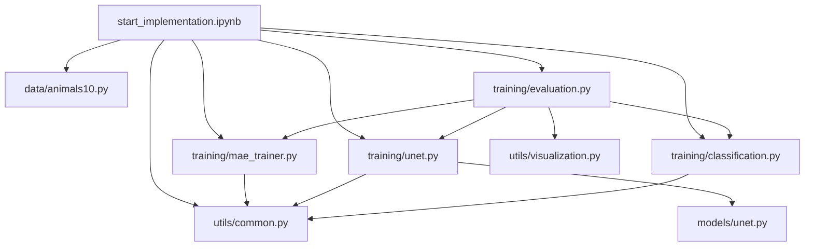

# MAE-animal-reconstruct-and-classification

Kaggle-first, notebook-only pipeline for Animals-10:
- MAE reconstruction pretraining
- U-Net reconstruction baseline
- MAE-encoder classification fine-tuning

Execution entrypoint:
- start_implementation.ipynb

## Project Structure

- start_implementation.ipynb
- data/animals10.py
- models/unet.py
- training/mae_trainer.py
- training/unet.py
- training/classification.py
- training/evaluation.py
- utils/common.py
- utils/visualization.py

## File Responsibilities

| File | Role | Edit Frequency |
|---|---|---|
| start_implementation.ipynb | Main orchestrator on Kaggle, config, step-by-step training/eval flow | High |
| data/animals10.py | Data discovery, split, transforms, dataloaders | Low |
| models/unet.py | U-Net architecture definition | Low |
| training/mae_trainer.py | MAE load/process/reconstruct + MAE train/eval loop | Low |
| training/unet.py | Patch masking + U-Net train/eval loop | Low |
| training/classification.py | MAE->classifier weight transfer + classifier train/eval | Low |
| training/evaluation.py | MAE vs U-Net comparison metrics + classifier metric wrapper | Low |
| utils/common.py | Shared seed/device/mixed-precision/checkpoint/json helpers | Low |
| utils/visualization.py | Save qualitative comparison PNG (original/masked/MAE/U-Net) | Low |

## Call Graph



## Kaggle Packaging

Zip only code files (do not include .venv/.git/cache/output):

```powershell
Compress-Archive -Path start_implementation.ipynb,data,models,training,utils,pyproject.toml,README.md -DestinationPath kaggle_code_bundle.zip -Force
```

## Kaggle Run Steps

1. Create a new Kaggle Notebook.
2. Add dataset animals10 so images are at /kaggle/input/animals10/raw-img.
3. Add your code zip as a Kaggle Dataset.
4. Unzip in first cell:

```python
!unzip -q /kaggle/input/<your-code-dataset>/kaggle_code_bundle.zip -d /kaggle/working/project
%cd /kaggle/working/project
```

5. Install dependencies if needed:

```python
!pip install -q torch torchvision transformers matplotlib
```

6. Open and run start_implementation.ipynb from top to bottom.

## Outputs On Kaggle

- Checkpoints: /kaggle/working/checkpoints/...
- Metrics JSON: /kaggle/working/results/...
- Comparison image: /kaggle/working/results/comparison/sample_comparison.png

## About Editing .py Files

Default workflow:
- Usually you do not need to edit .py files every run.
- You call functions/classes from notebook cells.
- Tune hyperparameters and experiment flow in start_implementation.ipynb.

When should you edit .py files:
- New model architecture
- New augmentation or split policy
- New metric, checkpoint format, or visualization behavior

In short: yes, you can call these .py modules from ipynb directly as reusable functions/classes.
